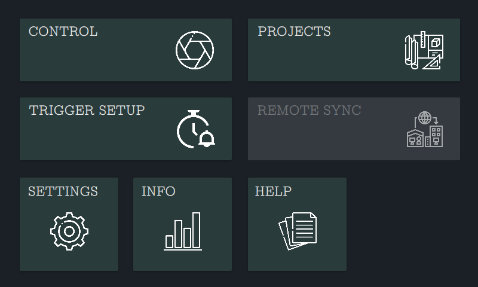
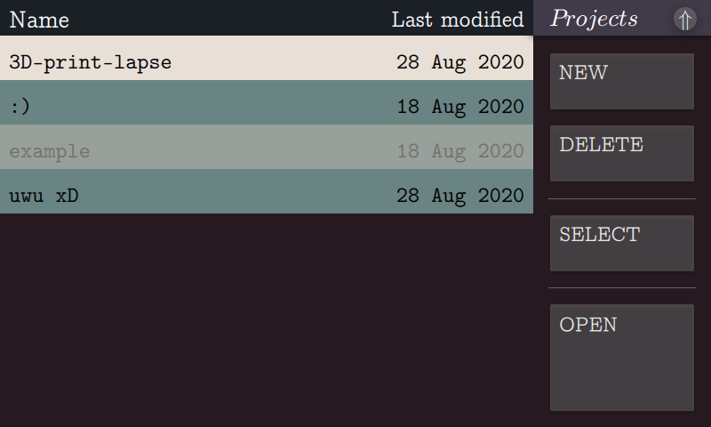
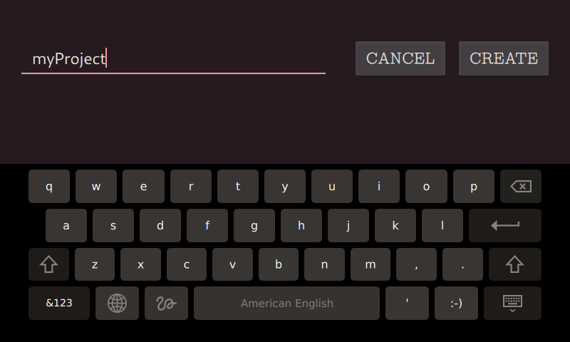
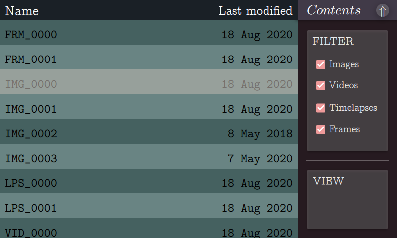
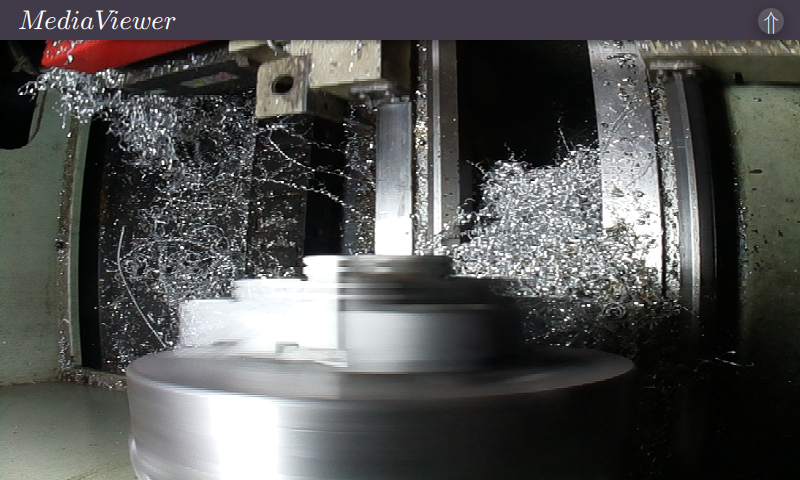
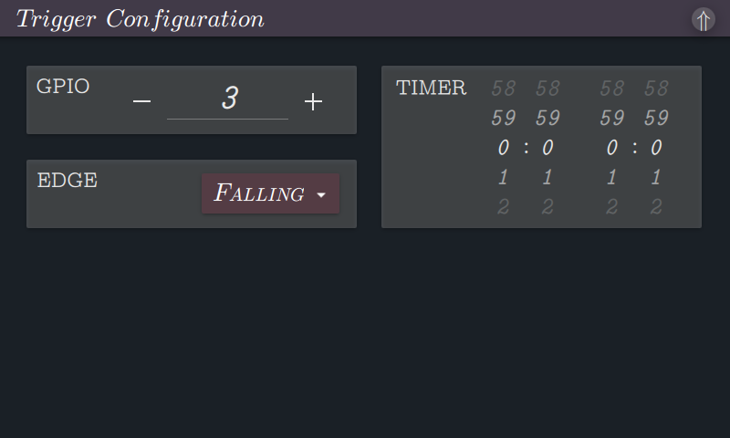
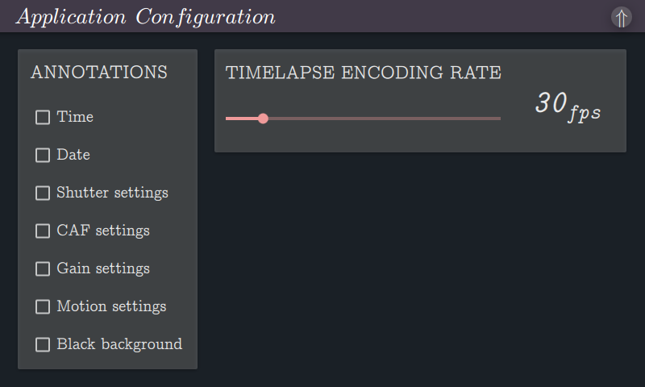

# ```camctrl```
Qt-based UI for camera control on the Raspberry Pi's 7" touch display.
### 



## Applications

- Embedded DIY DSLM camera
- Synchronous timelapse controller for CNC manufacturing processes, such as 3D printing, milling, or turning
- Optical microscopy
- Astrophotography
- Etc.

# §1 Installation
###### Before proceeding, please read the notice at the bottom of this README
#### §1.1 Download
Clone the repository and change working directory:

`$ git clone https://github.com/RiScJ/camctrl && cd camctrl`

#### §1.2 Retrieve and install dependencies
```camctrl``` is built in Qt and requires many of its modules. To install them, run:

`$ ./setup`

The list of dependencies is located in cfg/dependencies.

#### §1.3 Configuration
The configuration script will make certain modifications to the programs behavior, including such things as autostart. While you can choose to enable autostart on your first installation, it isn't recommended you do so. Instead, you should ensure the program runs as expected for you first. When you are satisfied with your installation and its behavior for your application, you can enable it then. Details on how to do this are found below. To configure, run:

`$ ./configure`

You will be asked a variety of questions. They are important -- read them carefully!

#### §1.4 Install
The installation script will handle the build process, and then copy binaries and static resources to /usr/local/bin and /usr/local/share/camctrl respectively. To install, run:

`$ ./install`

#### §1.5 Clean
Before cleaning, it would be wise to test the installation. To do so, run:

`$ camctrl -t`

This will run through an array of tests, and return a report at the end. If all tests passed, you can remove our temporary directory:

`$ ./clean all`

If you want to retain the sources, but remove the intermediary build files, you can:

`$ ./clean build`

# §2 Usage

```camctrl``` comes with a GUI (its main purpose), but it also comes with a set of commandline tools mostly designed for debugging before deploying to your application.

## §2.1 Commandline

### -t&nbsp;&nbsp;&nbsp;&nbsp;&nbsp;&nbsp;&nbsp;&nbsp;--test
Runs a series of tests on the application. Prints their results as they come in. At the end, a report is generated detailing any problems.

### -G&nbsp;&nbsp;&nbsp;&nbsp;&nbsp;&nbsp;&nbsp;&nbsp;--gpio
Displays a live reading in the commandline of measured GPIO levels. Good for testing your external triggering circuits.

### -f&nbsp;&nbsp;&nbsp;&nbsp;&nbsp;&nbsp;&nbsp;&nbsp;--fuse
Enables autostart, beginning with the next boot. You'll be asked to confirm before continuing. This is of course just a software behavior, and not a real fuse. I call it that because if at a later time you decide you want to disable the autostart behavior, it's going to be somewhat of a nuisance. You'll have to remove the SD card, mount it on another machine, and edit rc.local.

## §2.2 Graphical interface

### §2.2.1 Controlling the camera

The control window consists of three main areas: a camera preview to the left, a control panel to the right, and a statusbar at the bottom.

The control panel contains an interface for interacting with the camera, and the statusbar gives pertinent information about its state as well as that of the currently-active project.

#### §2.2.1.1 Changing the capture mode

```camctrl``` allows capturing media in three different "modes": images, videos, and timelapses. When capturing a timelapse, each trigger event signals the camera to take a single frame. When the timelapse is stopped, these frames can be stitched into a video automatically, or moved to a folder and stored to be stitched at a later time.

To change the capture mode, tap on the "Mode" tile. A menu will appear from which you may select the desired option.

#### §2.2.1.2 Changing the trigger mode

The power of the application lies mostly here. ```camctrl``` controls media capture using a "triggering" system, similar to the shutter button on a physical camera. There are three options for what presses this "shutter": manual input from the user; an internal timer; or an external GPIO connection.

To change the triggering mode, tap on the "Trigger" tile. A menu will appear from which you may select the desired option.

##### §2.2.1.2.1 Additional trigger configuration

For information on setting up trigger settings (such as time intervals and GPIO), see §2.2.3.1.

#### §2.2.1.3 Capturing media

The exact way media capture works depends on the above selections.

##### §2.2.1.3.1 Images

###### User-controlled

> Tap the "Capture" tile to take a single image.

###### Timed triggering

> Tap the "Capture" tile to begin taking images. Images will be taken non-stop, separated by your specified time interval, until you tap "Stop".

###### External triggering

> Tap the "Capture" tile to begin taking images. An image will be taken each time an edge of your specified type is detected on your specified pin, until you tap "Stop".

##### §2.2.1.3.2 Videos

###### User-controlled

> Tap the "Record" tile to start recording a video. Tap "Stop" to finish.

###### Timed triggering

> Tap the "Record" tile to start the process. Video will start recording after your specified delay time elapses. Video will continue recording until your specified duration time elapses, at which point it will pause. After another delay time, the recording resumes. The cycle will repeat indefinitely until you tap "Stop".

###### External triggering

> Tap the "Record" tile to start the process. Video will start recording when an edge of your specified type is detected on your specified pin. It will continue until another such edge is detected, at which point the video will pause. When another such edge is detected, the video recording resumes. This cycle will continue indefinitely until you tap "Stop".

##### §2.2.1.3.3 Timelapses

###### User-controlled

> Tap the "Lapse" tile to start. Tap the "Capture" tile to take a frame. You may do this as many times as you wish. When you are done, tap "Stop".

###### Timed triggering

> Tap the "Lapse" tile to start. A frame will be taken every time your specified delay time elapses. This will continue until you tap "Stop".

###### External triggering

> Tap the "Lapse" tile to start. A frame will be taken every time an edge of your specified type is detected on your specified pin. This will continue until you tap "Stop".

#### §2.2.1.4 The statusbar

The statusbar contains six pieces of information: the name of the currently-active project, the current capture mode, the current triggering mode, trigger-dependent information, the number of mediafiles of the current capture-type that are already in the project, and the current status of the application.

##### §2.2.1.4.1 Capture mode

On a trigger event, the application will...

> IMG -- capture a single image  

> VID -- either start or stop video recording  

> LPS -- start capturing a timelapse  

> FRM -- capture a single timelapse frame  

##### §2.2.1.4.2 Trigger mode

To serve as a trigger event, the application will use...

> USR -- user input  

> TMR -- the internal timer signal  

> EXT -- edges on a GPIO pin  

##### §2.2.1.4.3 Trigger-dependent information

###### User-controlled
> Empty  

###### Timed triggering
> Displays delay time. When started, will count down to next trigger event. If capture mode is VID, when the recording starts the delay time will be replaced with the duration time, which will also count down.  

###### External triggering
> Displays the GPIO pin number to listen for edges on. An arrow is also displayed showing whether to listen for rising or falling edges.  

##### §2.2.1.4.4 Application status  

###### IDLE
> The application is idle. No media is being captured.  

###### LISTENING
> The application is ready to accept a trigger event.  

###### RECORDING
> The application is currently recording video.  

###### CAPTURING
> The application is currently capturing an image or frame. Under typical circumstances, this process should be so fast that this status ought not ever be visible. 

### §2.2.2 Using the project manager

```camctrl``` uses the idea of "projects" to separate your work. How exactly you utilize them is up to you. Media within a project are considered separate from media within another. This is important because it allows you to conduct certain actions project-wise: things like stitching frames into timelapses, syncing only certain projects to a remote location, etc.  

The project manager consists of two main areas: a list view on the left, and a control panel on the right.  



The list view contains entries for each of your projects, displaying both their names and the last time you modified the project.  

The control panel contains an assortment of tiles which allow you to interact with the projects. You will find the ability to create new projects, delete projects, select the project you want to work on, and open them to see previews of the media you've captured.

#### §2.2.2.1 Creating a new project
To create a new project, tap the "Projects" tile to enter the project manager. Once there, tap the "New" tile. You'll be taken to a context with a single text input, and two buttons to either confirm or cancel. 



Tap the text input and an on-screen keyboard will appear. Type the desired name for your new project, and tap "Create". If successful, you should see a new project with the name you entered appear in the list view on the left side of the project manager.

#### §2.2.2.2 Deleting a project
Scroll through the list view on the left side of the project manager until you find the project you want to delete. Tap its entry, and a highlight bar will move over it. Once highlighted, tap the "Delete" tile. A popup window will appear letting you know that this action cannot be undone, and to make sure you are certain before continuing. 


If you are sure, tap "Confirm". You should see the project disappear from the list view.

#### §2.2.2.3 Selecting a project
To select a project to work on, scroll through the list view until you find it. Tap on it to move the highlight bar over the project in question. Once highlighted, tap the "Select" tile. The project's background color in the list view will change to a bright off-white.

#### §2.2.2.4 Using the media previewer
Once you have captured media for a project, you may wish to preview them. To do so, scroll through the list view to find the project in question. Highlight it by tapping its name, as above. Once highlighted, tap the "Open" tile. You will be taken to the media viewer's menu.



The media viewer's menu is similar to that of the project manager, composed of a list view on the left, and a control panel on the right.

The list view contains entries for each media file within the project. The control panel contains an interface for filtering the media, and opening them.

##### §2.2.2.4.1 Choosing a file
Choosing a media file is similar to choosing a project: simply scroll through the list, and select a file by tapping on it. Tap the "Open" tile to view the mediafile. 



If the mediafile is a video, after opening you will have to tap the screen to start playback.

##### §2.2.2.4.2 Filtering the media
If your project has a substantial number of mediafiles, you may wish to filter them to make them easier to manage. You can do so by checking and unchecking the boxes in the control panel. By default, all filetypes are checked.

### §2.2.3 Application settings

#### §2.2.3.1 Trigger configuration

To configure options for both timed and external triggering, tap on the "Trigger Setup" tile from the main window. 



Here you may select the GPIO pin for external triggering as well as whether to listen for rising or falling edges  

The tumblers in the "Timer" tile control intervals for timed triggering. The left tumbler controls the delay time, and the right tumbler controls the duration time.

#### §2.2.3.2 Miscellaneous settings

From the main window, tap the "Settings" tile. 



Here are options to add annotations to the captured media (such as timestamps or exposure settings), and change the framerate of the encoded timelapse.

#  
#  
#  
#  

# Notice
```camctrl``` is designed to be used as a standalone, embedded application on a *dedicated* Raspberry Pi. I recommend against using it on a device you need for something else. The program uses root privileges, and is intended to autostart on boot. I offer no insurance the software is bug-free. I've put a lot of work into this, but I'm not perfect. 

If you want/need ```camctrl``` to not autostart (such as for debugging, you only want to use some of its command-line tools, or you aren't using it on an embedded system), there is a configuration option to make it so. When you run ./configure immediately before installation, answer no to "Do you want camctrl to autostart on boot (embedded applications)?"

The application uses sudo priviliges for fast memory mapping over /dev/mem. I know /dev/gpiomem is available and does not require root. However, I have chosen to remain with /dev/mem for two reasons: I will need it for planned future features, and the program's nature as an (intended) embedded application effectively necessitates its backend to have elevated privileges. Privileges in the "userspace"/frontend are normal. 

Read the scripts and make sure you understand them before you run them. Always know what you are installing on your devices.
&nbsp;
