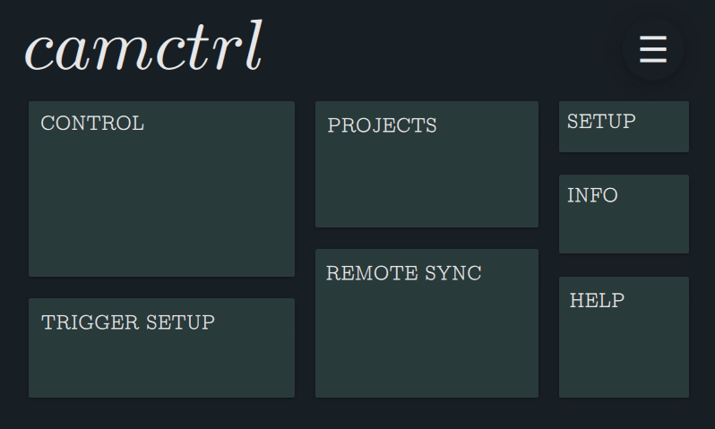
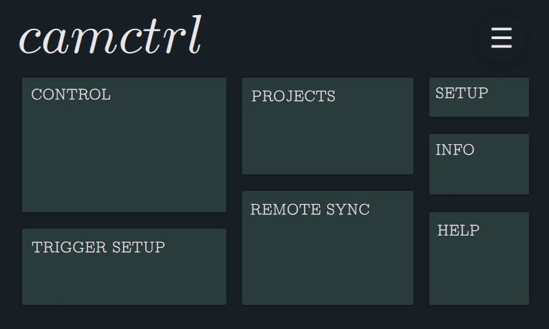
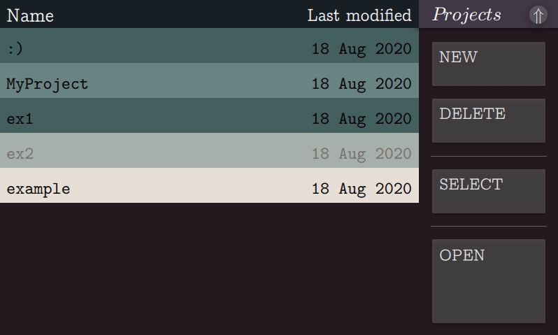
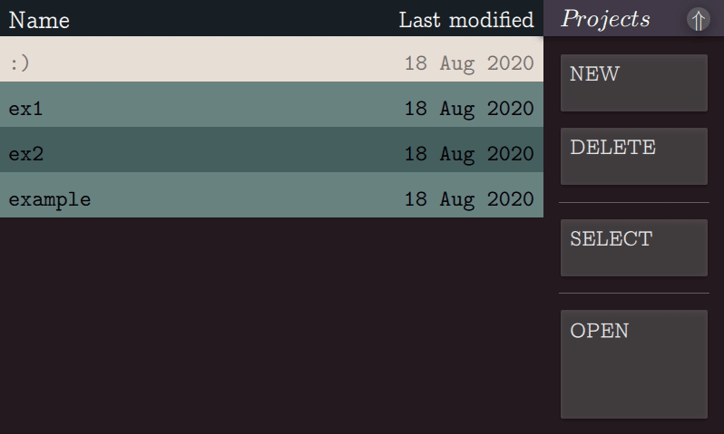

# ```camctrl```
Qt-based UI for camera control on the Raspberry Pi's 7" touch display.




## Applications
```camctrl``` is designed to be an embedded solution to capturing media for your projects using the Raspberry Pi's HQ camera. 


## Installation

## Usage
```camctrl``` is designed with the notion of projects in mind. To create a new project, simply navigate from the main menu to the "Projects" context, and press "New".



Removing a project is just as easy -- simply highlight the project you wish to delete and press "Delete". You'll be prompted with a message asking you to confirm you understand this action cannot be undone. If you're sure, just press "Confirm".





Once you've captured some media, you can preview it right on the device. Highlight the project in question and press "Open". Then highlight the media file in question and press "View":


